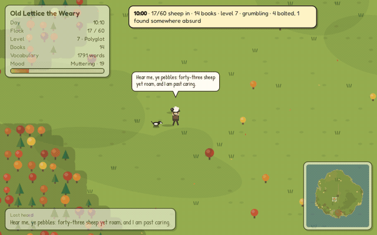
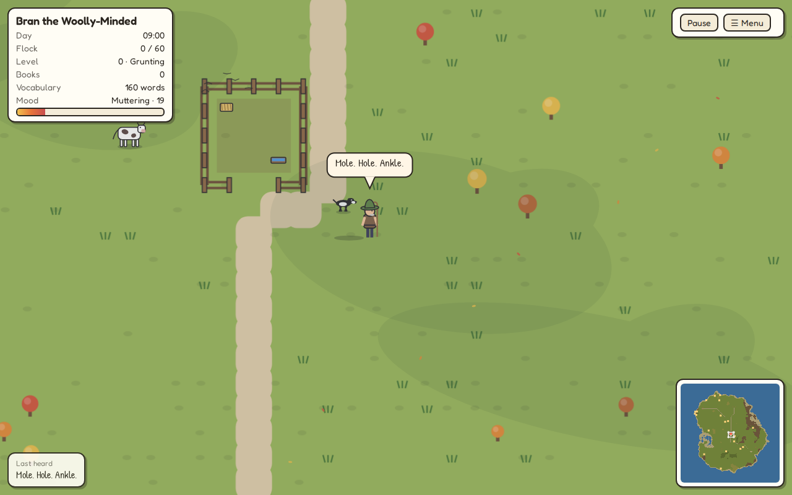
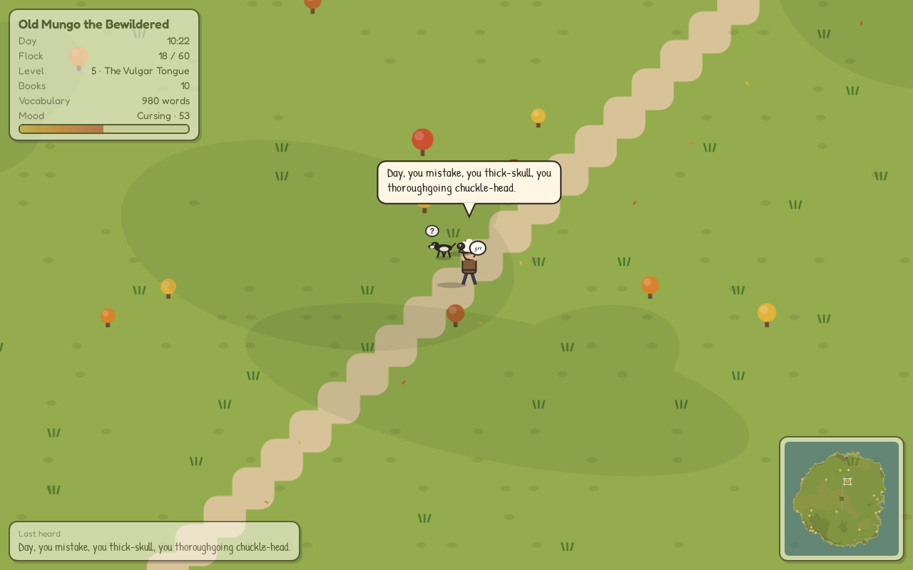
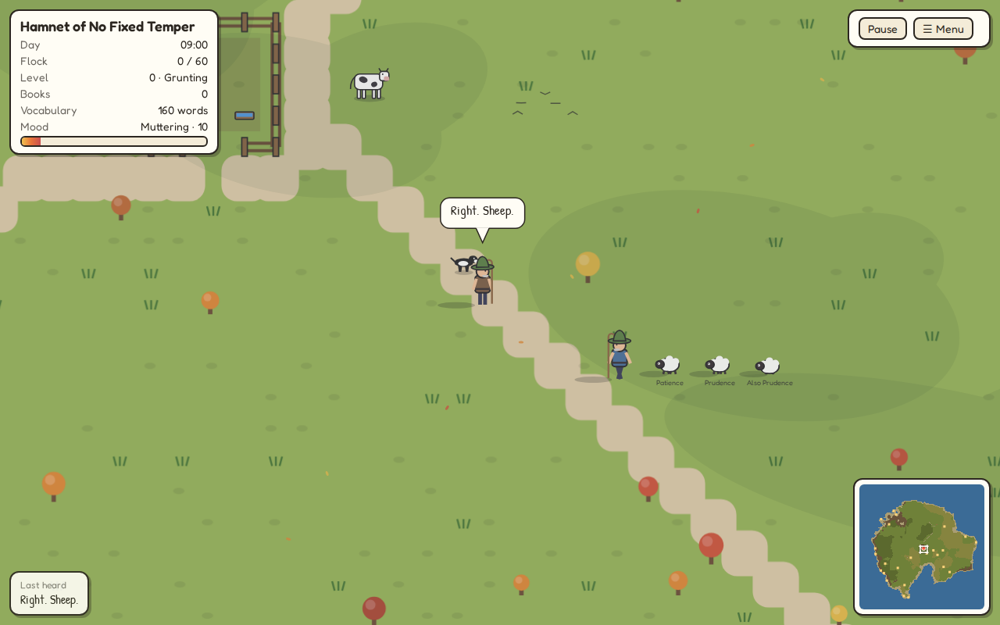
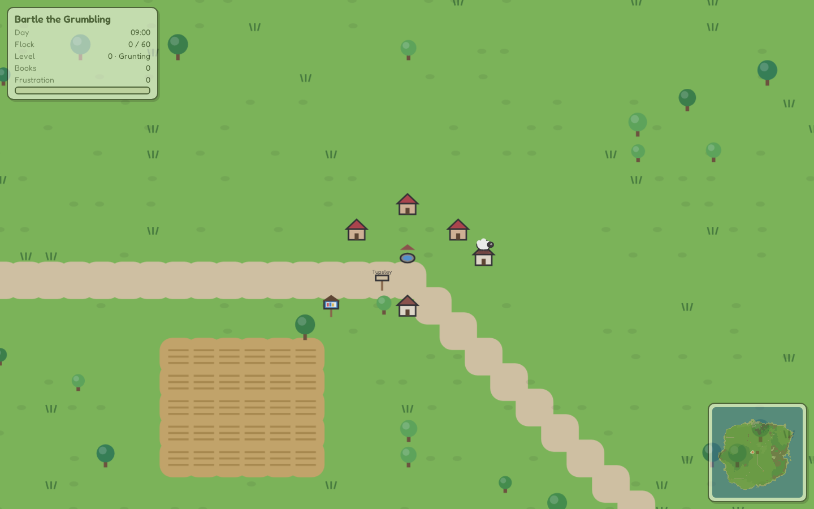
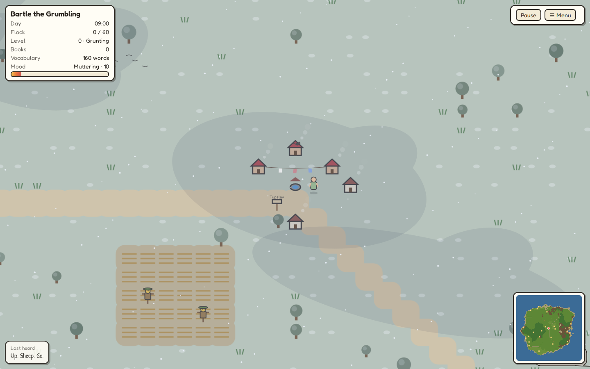
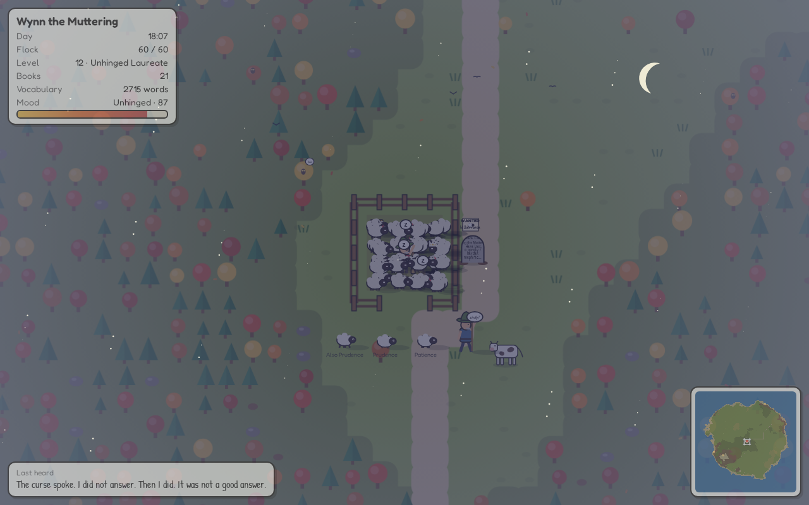
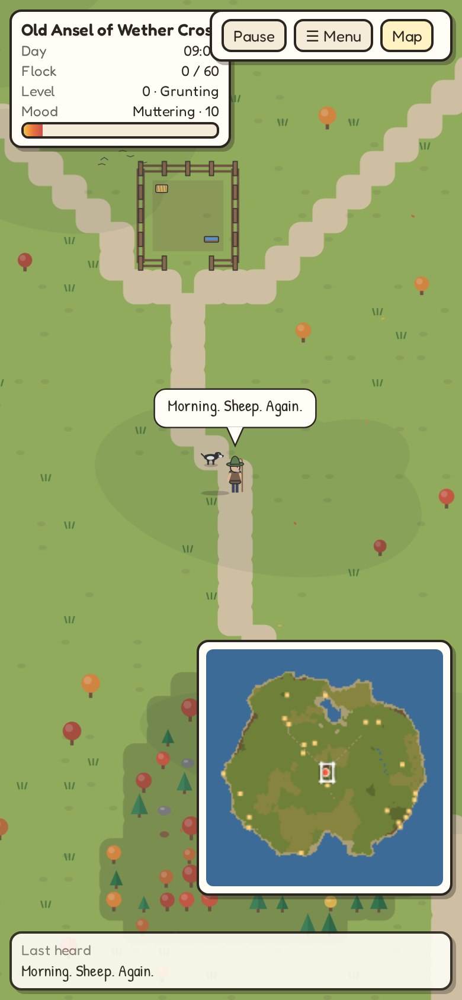

# Curse of the Herder

A no-input browser screensaver. A herder, cursed like Sisyphus to gather
his flock for all eternity, spends a nine-hour day carrying sheep home
across a large tile map. He starts the morning barely able to grunt.
By evening, after finding books in little free libraries along the way,
he curses in Shakespearean thou-and-thee, Hemingway declaratives,
the occasional "Goddamnit, Donut!",
Québécois sacres and Rabelaisian catalogs. When the last sheep is penned
he retires to the Hall of Herders, and his final curse goes on his
tombstone.

No LLM. Every line comes from a deterministic grammar over a curated
lexicon (about 1,600 words in eighteen packs) and several hundred
sentence structures. Filthy, never cruel.

**Play:** https://hunterdavis.com/curse-of-the-herder/

















## Running it

```sh
npm install
npm run dev          # local dev server
npm run check        # typecheck, unit tests, production build (the deploy gate)
npm run test:e2e     # Playwright smoke test against the built site
npm run pace -- --seeds 5      # headless pacing: how long does a board take?
npx tsx scripts/transcript.ts --seed demo   # print a whole day's lines
```

Useful URL parameters: `?fast=60` runs the day sixty times faster
(`600` finishes in about a minute), `?new=1` starts a fresh herder,
`?seed=word` fixes the board, `?clean=1` caps the language at minced
oaths for shared screens, `?filth=max` removes the frustration gate.

Keys: space pauses, N starts a new herder, H opens the Hall, M opens the
menu. The toolbar fades after ten quiet seconds; move the mouse to bring
it back. The menu holds everything else: New herder, the Hall, Load,
Language (full / mild / clean), what happens when the last sheep is in,
**Speed of the day** (1× to 100×, so a nine-hour day can be watched in
five minutes while testing), frame rate, and Export / Import of the
current herder and the Hall as JSON. Settings persist in the browser.

Every retired herder's Hall record carries his reading list: which books
he found, when, and a few of the words each one taught him. The map from
in-game titles to real public-domain sources is in
[docs/research/REAL_BOOKS.md](docs/research/REAL_BOOKS.md).

## How it works

- **Board.** A 576×576 seeded island: water, sand, grass, meadow,
  farmland, forest, mud, rock, snow, rivers, roads to five villages, and
  a fenced pen near the centre. Sixty sheep are placed in five rings of
  path distance so the day escalates. Twenty-four little free libraries
  sit a few tiles from sheep along the way.
- **Herder.** A* pathfinding over terrain costs; catch, carry, pen,
  repeat. Sheep flee, some are on roofs or in rivers ("how did you get up
  there"), repeat escapees earn names and a red ribbon. He detours for a
  book when empty-handed, sits and reads for a minute or two, and talks
  like the book for ten minutes afterwards. Sheep have temperaments:
  dozy ones sleep where they stand, curious ones walk up to him,
  stubborn ones will not be lifted on the first heave. The countryside
  fights back: bogs, nettles, cowpats, wasps, a sheep that bites, a gate
  that jams, and once a day the crook snaps. He eats lunch on a stump at
  half past twelve. His sheepdog follows him all day and helps with
  nothing. Rain, fog and wind come and go; a rainbow follows the rain.
  The first sheep to bolt three times becomes his nemesis, with a wanted
  poster and a triumph when it is finally caught; penned sheep plot a
  jailbreak in whispers before they go; runs of five and eight pennings
  without a flight are streaks he does not trust. At the pen he sometimes
  counts the old way: yan, tan, tethera, methera, pip.
  Three days in four a sheep eats his lunch while he watches. Once a day,
  after two, the dog actually herds a sheep to him, and nobody can explain
  it; on other days it lies down exactly where his boot was going.
  When he sits down the dog may bring him a stick, which he throws, and
  which is not a sheep. Mid-afternoon he stops at a village well for a
  drink of water, which is not ale. Each new level is announced, and he
  feels the words arrive.
- **Two axes drive every line.** *Eloquence* (level 0–12) comes from
  books; *frustration* (0–100) rises through the day with distance, rain,
  fleeing sheep and the walk of shame, and sets both curse frequency and
  the filthiness ceiling. Filth caps at R-rated; eloquence goes to twelve.
- **Language.** A Tracery-style grammar with morphology (a/an by sound,
  plurals, conjugation, thou/thee), band and level gating on every word,
  register weighting after reading, named sheep, time-of-day phrases, a
  per-herder signature word, and a repeat filter. A master ban list is
  enforced at build time (no lexicon or template may contain a banned
  word) and by a 15,000-generation never-emit test.
- **Time.** Real time drives the day; close the laptop and he catches up
  on return. A governor slows him (never speeds him) so the last sheep
  lands near six o'clock.
- **Rendering.** Plain Canvas2D: procedural blob-autotiled terrain in a
  chunk cache, procedural sheep and herder sprites, a following camera,
  day tint from dawn to dusk, rain, speech bubbles, wordless sheep emotes.
- **Life on the map.** Villagers by the wells who gasp and answer back
  ("Language!"), a neighbour in a blue coat who strolls past every couple
  of hours with three sheep that follow him in a line (even the dog goes
  to look; on the third pass one of them bolts, and he is thrilled), hens
  that scatter, an inn called the Cursed Ram that he walks past with
  difficulty, signposts whose certainty he resents, cows that explain the
  cowpats, loose sheep that drift over to
  listen while he reads aloud, the Curse itself heckling from the
  sidelines, washing lines, roof cats, chimney smoke, scarecrows he
  envies, ducks with ducklings, frogs, fish, rabbits that bolt, owls and
  a hedgehog at dusk, butterflies, birds, cloud shadows, rainbows,
  fireflies, shooting stars and a moon. The calendar sets the season:
  a herder who wakes in December gets snow, grey trees and visible
  breath; October turns the trees gold; each season has its own lines.
- **Looking around.** The minimap shows the viewport as a reticle. Click
  or hold-and-drag on it to look anywhere on the island; the view glides
  back to the herder two seconds after you let go.
- **Persistence.** IndexedDB. Start a new herder whenever; load any
  herder in progress; the Hall of Herders keeps every retired one with
  his epitaph, reading list, favourite word, sheep of the day, the
  highlights of his day, and his dog; an Almanac at the top of the Hall
  finds patterns across all of them.

## Measuring on your own machine

Add `?stats=1` to the URL for a small overlay showing the average frame
interval, the time spent drawing each frame (average and worst over the
last second), the tile size, and the JS heap where the browser exposes
it. Leave it running a minute; a healthy machine shows draw times well
under the frame interval. It works in any browser; Chrome also shows the
heap.

## Documents

- [PLAN.md](PLAN.md): product and technical plan, build phases.
- [BACKLOG.md](BACKLOG.md): prioritised work and the research index.
- `docs/research/`:
  [CURSE_PROGRESSION](docs/research/CURSE_PROGRESSION.md) ·
  [SENTENCE_GRAMMAR](docs/research/SENTENCE_GRAMMAR.md) ·
  [LEXICON](docs/research/LEXICON.md) ·
  [CONTENT_POLICY](docs/research/CONTENT_POLICY.md) ·
  [BOOKS](docs/research/BOOKS.md) ·
  [PACING](docs/research/PACING.md) ·
  [ART](docs/research/ART.md)
- [CREDITS.md](CREDITS.md): third-party sources.
- [CONTRIBUTING.md](CONTRIBUTING.md): how to add words and sentence shapes.

Inspired by, and borrowing runtime lessons from,
[The Grind 2](https://github.com/huntergdavis/the-grind-2).

## License

Code: MIT (see `LICENSE`). Third-party sources are listed in `CREDITS.md`.
